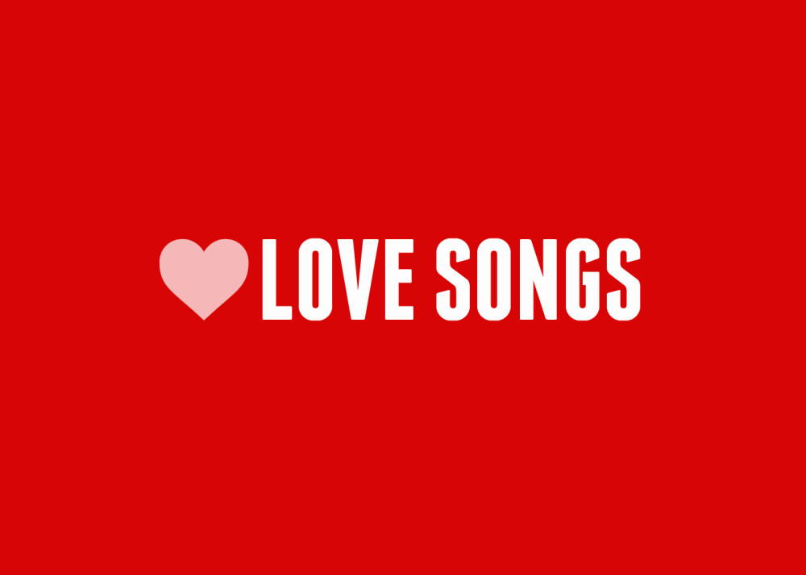

# Applied Data Science @ Columbia
## Fall 2019
## Project 1: A "data story" on the songs of our times



### [Project Description](doc/)
This is the first and only *individual* (as opposed to *team*) this semester. 

Term: Fall 2019

+ Projec title: What Do We Sing About When We Sing About Love
+ This project is conducted by Kangkang Zhang

+ Project summary: The project provides some exploratory data analysis for "Love" Song, that is, song with lyrics contain "love" more than once. Compare the chracteristics of "love" song lyrics among different music genres and different decades. Apply sentiment analysis to explore the love song story emotion trend as time goes by.

Following [suggestions](http://nicercode.github.io/blog/2013-04-05-projects/) by [RICH FITZJOHN](http://nicercode.github.io/about/#Team) (@richfitz). This folder is orgarnized as follows.

```
proj/
├── lib/
├── data/
├── doc/
├── figs/
└── output/
```

Please see each subfolder for a README file.
