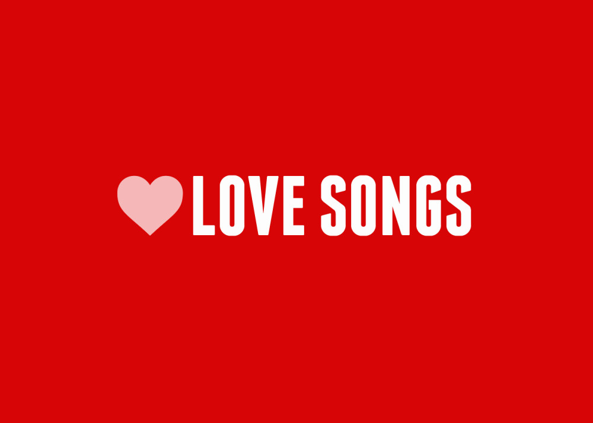

```{r setup, include=FALSE}
knitr::opts_chunk$set(echo = FALSE)
```

"lyrics.csv" is a filtered corpus of 380,000+ song lyrics from from MetroLyrics. You can read more about it on [Kaggle](https://www.kaggle.com/gyani95/380000-lyrics-from-metrolyrics).

```{r load libraries, warning=FALSE, message=FALSE}
library(tidyverse)
library(tidytext)
library(textdata)
library(plotly)
library(yarrr)
library(DT)
library(tm)
library(scales)
library(wordcloud)
library(gridExtra)
library(ngram)
library(qdap)
library(syuzhet)
library(radarchart)
```

```{r load data, warning=FALSE, message=FALSE}
# load lyrics data
load('./output/processed_lyrics.RData') 
```



```{r Preparations, warning=FALSE, message=FALSE}
time_list <- c("1970s", "1980s", "1990s", "2000s", "2010s")
corpus <- VCorpus(VectorSource(dt_lyrics$stemmedwords))
word_tibble <- tidy(corpus) %>%
  select(text) %>%
  mutate(id = row_number()) %>%
  unnest_tokens(word, text)
```

Love is an immortal topic in songs regardless of their genres or decades. A love song is a song about being in, falling in love, heartbreak upon the end of a love, and the feelings that these experiences bring. Today I focus on "love" songs, by definition, those songs whose lyrics contain "love" more than once, to explore the truly topic and emotion of those "love" songs.

### What are the lyric lengths for "love" songs across genre?

```{r length of lyrics, warning=FALSE, message=FALSE}
#filter love songs
word_tibble <- word_tibble %>% 
  filter(word == "love") %>% 
  group_by(id) %>% 
  count() %>% 
  filter(n > 1) %>% 
  ungroup() %>% 
  left_join(., word_tibble, by = "id")
  
#count lyric length
word_count_df <- dt_lyrics %>% 
  mutate(word.count = word_count(lyrics, byrow = TRUE)) 

#join word_count and stemmed word table
love_df <- word_count_df %>%
  mutate(id = row_number(),
         times = case_when(
    year >=1970 & year <1980 ~ time_list[1],
    year >=1980 & year <1990 ~ time_list[2],
    year >=1990 & year <2000 ~ time_list[3],
    year >=2000 & year <2010 ~ time_list[4],
    year >=2010  ~ time_list[5],
    year < 1970 ~ "Other"
  )) %>% 
  filter(id %in% word_tibble$id & times != "Other" & genre != "Not Available")

word_df <- love_df %>% 
  select(id, song, year, artist, genre, times, stemmedwords) %>% 
  left_join(word_tibble, by = "id") %>% 
  filter(!is.na(genre))

#compare across genre
p1 <- love_df %>% 
  select(genre, word.count) %>% 
  ggplot(aes(x = genre, y = word.count, color = genre)) +
  geom_boxplot() +
  viridis::scale_color_viridis(
    discrete = TRUE
  ) +
  labs(
    x = "Genre",
    y = "Lyric Length",
    color = "Genre",
    title = "Lyric length of 'love' songs across genre"
  ) +
  theme_bw() 

ggplotly(p1)
```

From the plot we can see that the median length of lyrics in Hip-Hop is much larger than it in any other kind of genre. This is reasonable because Hip-Hop songs often require singer rap in very fast speed, giving singer the chance to say more words out. Most of the values are in the close area, less than 1000. But there are still many extreme values, especially in Hip-Hop, Pop and Rock music.

```{r length of lyrics 2, warning=FALSE, message=FALSE}
#compare across times
p2 <- love_df %>% 
  select(times, word.count) %>% 
  ggplot(aes(x = times, y = word.count, color = times)) +
  geom_boxplot() +
  viridis::scale_color_viridis(
    discrete = TRUE
  ) +
  labs(
    x = "Times",
    y = "Total number of words",
    color = "Times",
    title = "The distribution of number of words in 'love' songs across time"
  ) +
  theme_bw()

ggplotly(p2)
```

From the plot we can see that the distributions look very similar to each others. But there is still a slight trend that as time went by, the lengths of the songs increased.

### Word diversity of "love" songs across decades

Here I use pirateplot in yarrr package to visualize lexical diversity as an aspect to measure the development trend of "love" songs.
```{r,  warning=FALSE, message=FALSE}
diversity <- word_df %>% 
  group_by(id, times) %>% 
  mutate(lex_diversity = n_distinct(word)) %>% 
  select(id, Released = times, lex_diversity) %>% 
  distinct() %>% 
  ungroup()
            
pirateplot(formula = lex_diversity ~ Released,
           data = diversity,
           xlab = NULL, ylab = "Song Distinct Word Count",
   main = "Lexical Diversity Per Decade", 
   pal = "google", 
   point.o = .2, 
   avg.line.o = 1, 
   theme = 0, 
   point.pch = 16, 
   point.cex = 1.5, 
   jitter.val = .1, 
   cex.lab = .9, cex.names = .7) 
```

Every colored circle in this pirate plot represents a song. The line for each decade represents the mean distinct word count. Overall the lexical diversty did not change a lot during the years, but we can see that the number of large extreme values increased, indicating that songwriters tend to write more different words in "love" songs. 

### What words in "love" songs are special for its times?

```{r tfidf, warning=FALSE, message=FALSE}
tfidf_gen_df <- word_df %>% 
  select(genre, word) %>% 
  group_by(genre, word) %>% 
  count() %>% 
  ungroup() 

tfidf_tim_df <- word_df %>% 
  select(times, word) %>% 
  group_by(times, word) %>% 
  count() %>% 
  ungroup() 

tf_idf_gen_result <- tfidf_gen_df %>% 
  bind_tf_idf(word, genre, n) %>% 
  group_by(genre) %>% 
  arrange(genre, desc(tf_idf)) %>% 
  top_n(20, tf_idf) %>% 
  select(genre, word, tf_idf)

tf_idf_tim_result <- tfidf_tim_df %>% 
  bind_tf_idf(word, times, n) %>% 
  group_by(times) %>% 
  arrange(times, desc(tf_idf)) %>% 
  top_n(20, tf_idf) %>% 
  select(times, word, tf_idf)

tf_gen_result <- tfidf_gen_df %>% 
  bind_tf_idf(word, genre, n) %>% 
  group_by(genre) %>% 
  arrange(genre, desc(tf)) %>% 
  top_n(20, tf) %>% 
  select(genre, word, tf)

tf_tim_result <- tfidf_tim_df %>% 
  bind_tf_idf(word, times, n) %>% 
  group_by(times) %>% 
  arrange(times, desc(tf)) %>% 
  top_n(20, tf) %>% 
  select(times, word, tf)
```

I use Term frequency and Term frequency–Inverse document frequency to respectively measure the key words for "love" songs in each decade.

$$
\begin{aligned}
TF(t)= \frac{\# word \ t \ appears \ in \ a \ song}{TTL \ \# words \ in \ the\  song}
\end{aligned}
$$

$$
\begin{aligned}
IDF(t)= \ln \frac{TTL\ \# word \ of \ songs }{\# songs \ with \ word\  t \ in \ it}
\end{aligned}
$$

$$
\begin{aligned}
TF-IDF(t)= TF(t) \cdot IDF(t)
\end{aligned}
$$

<br>

$1970S$

```{r 1970, warning=FALSE, message=FALSE}
#1970S
tf_tim_1970 = tf_tim_result %>% 
  filter(times == "1970s") %>%
  ungroup() %>% 
  select(word, tf) %>% 
  as.data.frame() 

#layout(matrix(c(1,2), 1, 2, byrow = TRUE))
wordcloud(tf_tim_1970$word, tf_tim_1970$tf, colors = brewer.pal(9,"RdBu"))
```

```{r, warning=FALSE, message=FALSE}
tfidf_tim_1970 = tf_idf_tim_result %>% 
  filter(times == "1970s") %>%
  ungroup() %>% 
  select(word, tf_idf) %>% 
  as.data.frame() 

wordcloud(tfidf_tim_1970$word, tfidf_tim_1970$tf_idf, colors = brewer.pal(9,"RdBu"))
```

The top wordcloud is the words of "love" songs with top 20 TF values in 1970S. The bottom is those with top 20 TF_IDF values. As expected, love, baby, women are very common words in 1970S love songs. But when we look at TF-IDF, things totally changed. There are representative love song singers Deanie and Eydie, and also some locations might be famous for romantice love story: Surabaya.

$1980S$

```{r 1980, warning=FALSE, message=FALSE}
#1980S
tf_tim_1980 = tf_tim_result %>% 
  filter(times == "1980s") %>%
  ungroup() %>% 
  select(word, tf) %>% 
  as.data.frame() 

wordcloud(tf_tim_1980$word, tf_tim_1980$tf, colors = brewer.pal(9,"RdBu"))
```

```{r, warning=FALSE, message=FALSE}
tfidf_tim_1980 = tf_idf_tim_result %>% 
  filter(times == "1980s") %>%
  ungroup() %>% 
  select(word, tf_idf) %>% 
  as.data.frame() 

wordcloud(tfidf_tim_1980$word, tfidf_tim_1980$tf_idf, colors = brewer.pal(9,"RdBu"))
```

Similarly, for TF, love, baby, heart are very common words in 1980S love songs. For TF-IDF, some words with no real meanings like whoahohoho, whoaoo and hooee.

$1990S$

```{r 1990, warning=FALSE, message=FALSE}
#1990S
tf_tim_1990 = tf_tim_result %>% 
  filter(times == "1990s") %>%
  ungroup() %>% 
  select(word, tf) %>% 
  as.data.frame() 

wordcloud(tf_tim_1990$word, tf_tim_1990$tf, colors = brewer.pal(9,"RdBu"))
```

```{r,  warning=FALSE, message=FALSE}
tfidf_tim_1990 = tf_idf_tim_result %>% 
  filter(times == "1980s") %>%
  ungroup() %>% 
  select(word, tf_idf) %>% 
  as.data.frame() 

wordcloud(tfidf_tim_1990$word, tfidf_tim_1990$tf_idf, colors = brewer.pal(9,"RdBu"))
```

For 1990S, the important words (TF-IDF) are very similar to those in 1980S, sugguesting that the "love" songs content did not change a lot during that 20 years.

$2000S$

```{r 2000, warning=FALSE, message=FALSE}
#2000S
tf_tim_2000 = tf_tim_result %>% 
  filter(times == "2000s") %>%
  ungroup() %>% 
  select(word, tf) %>% 
  as.data.frame() 

wordcloud(tf_tim_2000$word, tf_tim_2000$tf, colors = brewer.pal(9,"RdBu"))
```

```{r, warning=FALSE, message=FALSE}
tfidf_tim_2000 = tf_idf_tim_result %>% 
  filter(times == "2000s") %>%
  ungroup() %>% 
  select(word, tf_idf) %>% 
  as.data.frame() 

wordcloud(tfidf_tim_2000$word, tfidf_tim_2000$tf_idf, colors = brewer.pal(9,"RdBu"))
```


$2010S$

```{r 2010, warning=FALSE, message=FALSE, fig.height= 50}
#2010S
tf_tim_2010 = tf_tim_result %>% 
  filter(times == "2010s") %>%
  ungroup() %>% 
  select(word, tf) %>% 
  as.data.frame() 

wordcloud(tf_tim_2010$word, tf_tim_2010$tf, colors = brewer.pal(9,"RdBu"))
```

```{r, warning=FALSE, message=FALSE}
tfidf_tim_2010 = tf_idf_tim_result %>% 
  filter(times == "2010s") %>%
  ungroup() %>% 
  select(word, tf_idf) %>% 
  as.data.frame() 

wordcloud(tfidf_tim_2010$word, tfidf_tim_2010$tf_idf, colors = brewer.pal(9,"RdBu"))
```

We can find the TF-IDF word clouds for 2000S and 2010S are very simialr and very diffrent from previous clouds. "love" songs tend to be colloquial. It is probably because as the development of society, people are more brave and unconstrained to speak out what they are thinking deep in heart.

### What emotions do those "love" songs show?

I used two sentiment datasets in tidytext package. 

* Bing: assigns words into positive and negative categories
*  NRC: assigns words into one or more of the following  categories: positive, negative, anger, anticipation, disgust, fear, joy, sadness, surprise, and trust


```{r, warning=FALSE, message=FALSE}
love_bing <- word_df %>%
  inner_join(get_sentiments("bing"))

love_nrc <- word_df %>% 
  inner_join(get_sentiments("nrc"))

love_nrc_sub <- word_df %>% 
  inner_join(get_sentiments("nrc"))%>%
  filter(!sentiment %in% c("positive", "negative"))
```

#### rank of proportion of different emotion among all "love" songs
```{r, warning=FALSE, message=FALSE}
p6 <- love_nrc %>%
  group_by(sentiment) %>%
  summarise(word_count = n()) %>%
  ungroup() %>%
  mutate(sentiment = reorder(sentiment, word_count)) %>%
  ggplot(aes(sentiment, word_count, fill = -word_count)) +
  geom_col() +
  guides(fill = FALSE) +
  theme_bw() +
  labs(x = NULL, y = "Word Count") +
  ggtitle(" 'Love' Songs Sentiment") +
  coord_flip()

ggplotly(p6)
```

We can see that in the past 50 years, majority of love songs have positive attitude and joy emotion. Still many songs have sadness and negative emotions. Overall, when singers sing about love, the theme of the song is usually happy and full of joy.

#### Proportion of postive lyric words in "love" song per decade

```{r, warning=FALSE, message=FALSE}
love_polarity_times <- love_bing %>%
  count(sentiment, times) %>%
  spread(sentiment, n, fill = 0) %>%
  mutate(polarity = positive - negative,
    percent_positive = positive / (positive + negative) * 100)

p4 <- love_polarity_times %>%
  ggplot( aes(times, percent_positive, fill = times)) +
  geom_col() +
  #geom_hline(yintercept = 0, color = "red") +
  xlab(NULL) + ylab(NULL) +
  viridis::scale_fill_viridis(
    discrete = TRUE
  ) 

ggplotly(p4)
```

An interesting thought. There is a slight downward trend of positive percent of love song words as time goes by. In 1970S and 1980S, over 60% of love songs sing about positive emotions. People at that time might have a more positive attitude towards love. Nowadays, more and more singers tend to sing about negative love stories.

#### Proportion of postive lyric words in "love" song per genre

```{r, warning=FALSE, message=FALSE}
love_polarity_genre <- love_bing %>%
  count(sentiment, genre) %>%
  spread(sentiment, n, fill = 0) %>%
  mutate(polarity = positive - negative,
    percent_positive = positive / (positive + negative) * 100)

p5 <- love_polarity_genre %>% 
   mutate(genre = reorder(genre, percent_positive)) %>% 
  ggplot( aes(genre, percent_positive, fill = genre)) +
  geom_col() +
  #geom_hline(yintercept = 0, color = "red") +
  xlab(NULL) + ylab(NULL) +
  ggtitle("Percent Positive By genres") +
  viridis::scale_fill_viridis(
    discrete = TRUE
  ) 

ggplotly(p5)
```

For different music genre, metal nad hip-hop love songs have significant less positive percent of lyric words. This might because of their development history. Jazz has the largest positive percent of lyric words. 

#### Proportion of different emotions per decade

```{r}
#Get the count of words per sentiment per year
times_sentiment_nrc <- love_nrc_sub %>%
  group_by(times, sentiment) %>%
  count(times, sentiment) %>%
  select(times, sentiment, sentiment_times_count = n)

#Get the total count of sentiment words per year (not distinct)
total_sentiment_times <- love_nrc_sub %>%
  count(times) %>%
  select(times, times_total = n)

#Join the two and create a percent field
times_radar_chart <- times_sentiment_nrc %>%
  inner_join(total_sentiment_times, by = "times") %>%
  mutate(percent = sentiment_times_count / times_total * 100 ) %>%
  select(-sentiment_times_count, -times_total) %>%
  spread(times, percent) %>%
  chartJSRadar(showToolTipLabel = TRUE,
               main = "NRC Decades Radar")

times_radar_chart
```

The radar plot strenthend the conclusion that love songs in 1970S and 1980S talk more about positive attitude, since they have lowest proportion of sadness, anger and fear, and highest proportion of joy. 2000S and 2010S love songs have highest proportion of fear and anger, very opposite from the old time love songs.

#### Proportion of different emotions per genre

```{r}
#Get the count of words per sentiment per genre
genre_sentiment_nrc <- love_nrc_sub %>%
  group_by(genre, sentiment) %>%
  count(genre, sentiment) %>%
  select(genre, sentiment, sentiment_genre_count = n)

#Get the total count of sentiment words per genre (not distinct)
total_sentiment_genre <- love_nrc_sub %>%
  count(genre) %>%
  select(genre, genre_total = n)

#Join the two and create a percent field
genre_radar_chart <- genre_sentiment_nrc %>%
  inner_join(total_sentiment_genre, by = "genre") %>%
  mutate(percent = sentiment_genre_count / genre_total * 100 ) %>%
  select(-sentiment_genre_count, -genre_total) %>%
  spread(genre, percent) %>%
  chartJSRadar(showToolTipLabel = TRUE,
               main = "NRC Decades Radar")

genre_radar_chart
```

For R&B and Jazz "love" songs, they have the highest proportions of joy. jazz also has the lowest proportion of anger. Hip-Hop and Metal "love" songs have highest value of proportions of anger and fear. We see that joy and anger is a set of opposite emotions. 


### Conclusion

* Important words in lyrics of "love" songs vary a lot among 1970-1989 and 2000-2019. Song writers in old times prefer writing romantic love story, while nowadays song writers prefer talking about their true feelings.

*If someone wants to fit in the new ara of love songs, maybe she/he can write a sad love story song.

* Different genres of song writers have difference preferences for telling what kind of love story. For Jazz love songs, happy is most common For Hip-Hop, anger is more common.
